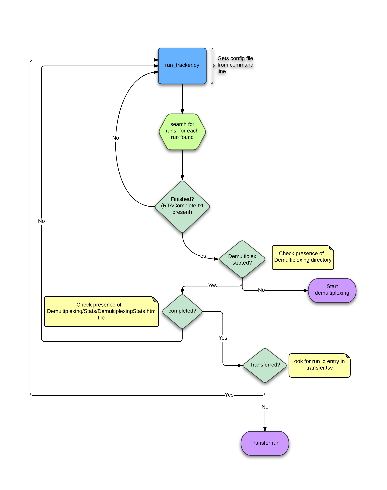

Run tracker
===========

This script is used to track finished runs on our processing servers and pre-process them.

After pre-processing, which basically is converting from BCL to FAST and demultiplexing,
the runs are sent to the analysis cluster. A simple CSV file is used to keep track
of the already transferred files.

The script uses the status files generated by both the sequencers and ``bcl2fastq``
to know what is the status of the run and act accordingly.

The following flow chart summarizes the workflow of this script.

The script requires the following options in a configuration file to run:

.. code-block:: yaml

    preprocessing:
        hiseq_data_dir: /path/to/hiseq/data
        miseq_dat_dir: /path/to/miseq/data
        # MFS server to put metadata in
        mfs: /path/to/mfs/partition
        # Directory where to find status files for transfers and analysis
        status_dir: /path/to/status_dir
        # Location of samplesheets for demultiplexing
        samplesheets_dir: /path/to/samplesheets/dir
        bcl2fastq: 
            path: /path/to/bcl2fastq
            - all command line options of bcl2fastq , i.e runfolder, input-dir, etc.
        sync:
            user: remote_user_analysis_server
            host: analysis_server
            data_archive: /path/where/to/transfer/data
            include:
                - "files"
                - "to"
                - "include"
                - "in"
                - "the"
                - "transfer"
        analysis:
            host: analysis_server
            port: port
            url: url_to_start_flowcell_analysis

Call the script like this for a default run: ``run_tracker.py --config config.yaml``